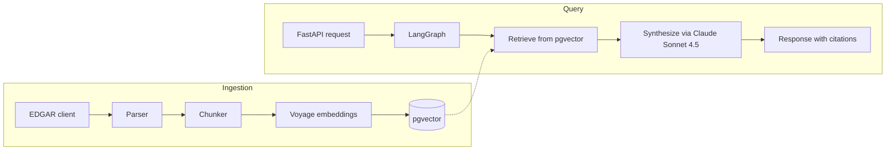

# edgar-analyst

**RAG over public SEC EDGAR filings using Python, LangChain, and LangGraph.**

## What this is

edgar-analyst ingests public SEC filings (10-K, 10-Q, 8-K), embeds them into a pgvector store on Postgres, and answers natural-language questions about them with cited sources. Synthesis runs on Anthropic Claude Sonnet 4.5 inside a LangGraph state machine; retrieval uses Voyage AI embeddings (`voyage-3`).

## Status

v0.3.0 — Retrieval and synthesis. The query path embeds a question via Voyage, retrieves top-k chunks from pgvector by cosine similarity, and synthesizes an answer with Anthropic Claude Sonnet 4.5 inside a LangGraph state machine. Inline `[chunk_id=N]` markers are parsed into a citation list. Both a CLI command and a streaming FastAPI endpoint are available.

## Architecture

The system has two paths. **Ingestion** pulls filings from EDGAR, parses and chunks them, embeds the chunks via Voyage, and writes them to pgvector. **Query** receives a question over HTTP, retrieves relevant chunks, and runs them through a LangGraph synthesis flow that produces an answer with inline citations to the source filing and section.



## Tech stack

| Layer | Choice |
| --- | --- |
| Language | Python 3.12 |
| Orchestration | LangChain, LangGraph |
| Chat model | Anthropic Claude Sonnet 4.5 (via Anthropic API) |
| Embeddings | Voyage AI `voyage-3` (1024-dim) |
| Vector store | pgvector on Postgres 16 |
| API | FastAPI |
| Frontend | React + Vite (planned, v0.4.0) |
| Tooling | uv, ruff, mypy, pytest |
| Eval / observability | LangSmith (optional, env-gated) |

## Run it locally

```bash
git clone https://github.com/GanB/edgar-analyst.git
cd edgar-analyst
cp .env.example .env  # then edit with your API keys
uv sync
docker compose up -d postgres
uv run uvicorn edgar_analyst.api.main:app --reload
# in another terminal:
curl localhost:8000/health
```

The CLI banner is also useful as a smoke test:

```bash
uv run edgar-analyst hello
```

### v0.2.0 ingestion

Initialize the schema, ingest a filing, and verify the row count:

```bash
docker compose up -d postgres
uv run edgar-analyst init-db
uv run edgar-analyst ingest --ticker AAPL --form 10-K
uv run edgar-analyst verify --ticker AAPL
```

`ingest` resolves the ticker to a CIK via SEC's company tickers feed, fetches
the most recent filing of the requested form type, parses its sections, chunks
each section to ~500 tokens with 50 token overlap, embeds the chunks via
Voyage `voyage-3`, and upserts them into the `documents` table. Re-running
`ingest` for the same filing is idempotent: rows are updated in place via
`ON CONFLICT (accession_no, chunk_index)`.

10-Q ingestion follows the same shape:

```bash
uv run edgar-analyst ingest --ticker AAPL --form 10-Q
```

### v0.3.0 query

Ask a question about an ingested filing from the CLI:

```bash
uv run edgar-analyst ask --ticker AAPL "What are Apple's biggest risk factors?"
```

The output is the synthesized answer (with inline `[chunk_id=N]` markers
that map back to the source filing) followed by a `Sources:` section
listing every cited chunk with its item id, section title, accession
number, chunk index, and a snippet.

The same flow is exposed as a streaming HTTP endpoint:

```bash
uv run uvicorn edgar_analyst.api.main:app --reload
curl -N -X POST localhost:8000/v1/query \
     -H "Content-Type: application/json" \
     -d '{"ticker":"AAPL","question":"What are Apple risk factors?"}'
```

The endpoint emits Server-Sent Events: one `event: token` per streamed
chunk, then a single `event: citations` with the deduped list, then a
terminal `event: done`. Default top-k is 8 (override via `RETRIEVAL_TOP_K`).

## Project structure

```
src/edgar_analyst/
├── api/          FastAPI app and routes
├── cli.py        click CLI (entry point: edgar-analyst)
├── ingestion/    EDGAR fetch + parse + chunk + embed (v0.2.0)
├── retrieval/    Voyage query embedding + pgvector cosine search
├── synthesis/    LangGraph state machine for query answering
├── eval/         LangSmith-backed eval harness (v0.5.0)
└── settings.py   Pydantic-settings configuration
```

Architecture decisions live in [`docs/adr/`](docs/adr/).

## Roadmap

- **v0.1.0** — Skeleton, health endpoint, no-op LangGraph spine.
- **v0.2.0** — EDGAR ingestion pipeline (fetch, parse, chunk, embed, upsert).
- **v0.3.0 (current)** — Retrieval and synthesis with citations end-to-end (CLI + streaming HTTP).
- **v0.4.0** — React + Vite query UI; cross-encoder reranker.
- **v0.5.0** — LangSmith eval harness with retrieval and faithfulness metrics.
- **Future** — ECS Fargate deploy when there is a reason to keep it running.

## License

Apache-2.0. See [LICENSE](LICENSE).
